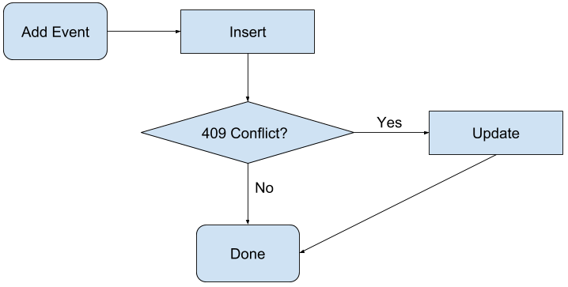

# Batching Monads

### Combining Free Monad and Free Applicative FTW

Cary Robbins

March 20, 2018

---

## Problem
We need to integrate with Google Calendar

However, we project that we will be rate limited.

---

## Solution
Google provides a batch API, let's just use that!

---

## Restrictions
The Google batch API only permits 50 requests per batch request.

---

## The problem with monads

<pre><code data-noescape data-trim class=scala>
for {
  x <- process1
  y <- process2
  z <- process3
} yield (x, y, z)

<span class=fragment>// Desugars to

process1.flatMap(x =>
  process2.flatMap(y =>
    process3.map(z =>
      (x, y, z)
    )
  )
)</span>
</code></pre>

Note:
* Say we have three processes to run, but they are not interdependent on one
  one another.
* We want to batch these steps, is it possible with a Monad?

* Unfortunately, no.
* Monadic actions are inherently dependent on one another
* Each step must have access to the results of the steps that came before.

---

## Applicative to the rescue

<pre><code data-noescape data-trim class=scala>
(process1, process2, process3).tupled

<span class=fragment>// Rougly equivalent to

val ff = ((a: A) => (b: B) => (c: C) => (a, b, c)).pure[F]
// ff: F[A => B => C => (A, B, C)]</span>

<span class=fragment>val f1 = ff.ap(process1)
// f1: F[B => C => (A, B, C)]</span>

<span class=fragment>val f2 = f1.ap(process2)
// f2: F[C => (A, B, C)]</span>

<span class=fragment>val f3 = f2.ap(process3)
// f3: F[(A, B, C)]</span>
</code></pre>

Note:
* Applicative is less powerful because it doesn't have flatMap.
* As such, we know that the steps used when restricted to Applicative are not
  interdependent on one another.
* The ap method is what makes this possible.
* Given that we have an Applicative for F,
  ap can apply a function that is contained in some F,
  returning a new F value to be evaluated
* This allows us to combine F computations, allowing its interpreter
  to decide how to evaluate it.

---

## The Free Monad

<pre><code data-noescape data-trim class="scala">
sealed abstract class Free[S[_], A]

<span class="fragment">final case class Pure[S[_], A](a: A)       extends Free[S, A]</span>

<span class="fragment">final case class Suspend[S[_], A](a: S[A]) extends Free[S, A]</span>

<span class="fragment">final case class FlatMapped[S[_], B, C](
  c: Free[S, C], f: C => Free[S, B]
) extends Free[S, B]</span>
</code></pre>

Note:
* The Free Monad is represented as a structure.
* This allows us to encode Monadic things in data structures
  to be evaluated later.
* The S type argument represents some context in which the Free Monad
  will be evaluated. For our use cases, this will be our Command.

---

## Free Applicative

<pre><code data-noescape data-trim class="scala">
sealed abstract class FreeApplicative[F[_], A]

<span class="fragment">final case class Pure[F[_], A](a: A)     extends FreeApplicative[F, A]</span>

<span class="fragment">final case class Lift[F[_], A](fa: F[A]) extends FreeApplicative[F, A]

<span class="fragment">final case class Ap[F[_], P, A](
  fn: FreeApplicative[F, P => A], fp: FreeApplicative[F, P]
) extends FreeApplicative[F, A]</span>
</code></pre>

Note:
* Free Applicative is structured in the same way

---

## A tale of two Algebras

<pre><code data-noescape data-trim class="scala">
object GoogleCalendarClient {
  sealed trait Action[A]
  <span class=fragment>final case class CalendarsGet(...) extends Action[Option[GCalendar]]</span>
  <span class=fragment>final case class EventsGet(...)    extends Action[Option[GCalendarEvent]]</span>
  <span class=fragment>final case class EventsInsert(...) extends Action[GCalendarEvent]</span>
  <span class=fragment>final case class EventsUpdate(...) extends Action[GCalendarEvent]</span>
  <span class=fragment>final case class EventsDelete(...) extends Action[Unit]</span>
}
</code></pre>

---

## A tale of two Algebras

<pre><code data-noescape data-trim class="scala">
object ExternalCalendarClient {
  sealed trait Action[A]
  <span class=fragment>final case class AddEvent(...)    extends Action[Unit]</span>
  <span class=fragment>final case class DeleteEvent(...) extends Action[Unit]</span>
  <span class=fragment>final case class EventExists(...) extends Action[Boolean]</span>
  <span class=fragment>final case class UpdateEvent(...) extends Action[Unit]</span>
}
</code></pre>

---

## Applicative Requests

<pre><code data-noescape data-trim class="scala">
import GoogleCalendarClient.{Methods => G}

val request: Request[(Option[GCalendar], GCalendarEvent)] =
  <span class=fragment>(G.calendars.get(...)</span><span class=fragment>, G.events.insert(...))</span>)<span class=fragment>.tupled</span>

val response: F[(Option[GCalendar], GCalendarEvent)] =
  <span class=fragment>client.run(request)</span>
</code></pre>

---

## Commands and Requests

<pre><code data-noescape data-trim class="scala">
// We need to follow this pattern for ExternalCalendarClient as well.
object GoogleCalendarClient {
  sealed trait Command[A]
  <span class=fragment>final case class Pure[A](value: A)          extends Command[A]</span>
  <span class=fragment>final case class Exec[A](action: Action[A]) extends Command[A]</span>

  <span class=fragment>type Request[A] = FreeApplicative[Command, A]</span>

  <span class=fragment>def exec[A](action: Action[A]): Request[A] =
    FreeApplicative.lift(Command.Exec(action))</span>
}
</code></pre>

---

## Commands and Requests

<pre><code data-noescape data-trim class="scala">
// We need to follow this pattern for ExternalCalendarClient as well.
object GoogleCalendarClient {
  object Methods {
    object calendars {
      <span class=fragment>def get(...):    Request[Option[GCalendar]]      = exec(CalendarsGet(...))</span>
    }
    object events {
      <span class=fragment>def insert(...): Request[GCalendarEvent]         = exec(EventsInsert(...))</span>
      <span class=fragment>def update(...): Request[GCalendarEvent]         = exec(EventsUpdate(...))</span>
      <span class=fragment>def delete(...): Request[Unit]                   = exec(EventsDelete(...))</span>
      <span class=fragment>def get(...):    Request[Option[GCalendarEvent]] = exec(EventsGet(...))</span>
    }
  }
}
</code></pre>

---

## Commands and Requests

```scala
import GoogleCalendarClient.{Methods => G}

val request: Request[Option[GCalendar]] = G.calendars.get(...)

val response: F[Option[GCalendar]] = client.run(request)
```

---

## Applicative Requests Revisited

```scala
import GoogleCalendarClient.{Methods => G}

val request: Request[(Option[GCalendar], GCalendarEvent)] =
  (G.calendars.get(...), G.events.insert(...)).tupled

val response: F[(Option[GCalendar], GCalendarEvent)] =
  client.run(request)
```

---

## HTTP Client Interface

```scala
trait GoogleCalendarClient[F[_]] {
  def run[A](r: GoogleCalendarClient.Request[A]): F[A]
}
```

---

## Implementing the interface

```scala
final class BatchingGoogleCalendarClient[F[_]](
  implicit F: MonadError[F, Throwable]
) extends GoogleCalendarClient[F] {
  override def run[A](r: GoogleCalendarClient.Request[A]): F[A] = ???
}
```

---

## FunctionK

<pre><code data-noescape data-trim class="scala">
trait FunctionK[F[_], G[_]] {
  def apply[A](fa: F[A]): G[A]
}

<span class=fragment>type ~>[F[_], G[_]] = FunctionK[F, G]</span>
</code></pre>

Note:
This is also known as a natural transformation

---

## FunctionK

<pre><code data-noescape data-trim class="scala">
val optionToList = new (Option ~> List) {
  override def apply[A](fa: Option[A]): List[A] = fa match {
    case None    => Nil
    case Some(x) => List(x)
  }
}

<span class=fragment>// Using kind-projector

val optionToList = λ[Option ~> List] {
  case None    => Nil
  case Some(x) => List(x)
}
</code></pre>

---

## FreeApplicative#compile

```scala
sealed abstract class FreeApplicative[F[_], A] {
  ...
  /**
    * Interpret this algebra into another algebra.
    * Stack-safe.
    */
  def compile[G[_]](f: F ~> G): FreeApplicative[G, A] = ...
}
```

---

## Baby's first interpreter

<pre><code data-noescape data-trim class="scala">
type CommandWithId[A] = (UUID, Command[A])

val idGenCompiler = λ[Command ~> CommandWithId] {
  (c: Command[A]) => (UUID.randomUUID(), c)
}

<span class="fragment">r: Request[A] = ...</span>
<span class="fragment">r: FreeApplicative[Command, A] = ...</span>
<span class="fragment">val commandsWithIds: FreeApplicative[CommandWithId, A] = r.compile(idGenCompiler)</span>
</code></pre>

---

## FreeApplicative#analyze

```scala
sealed abstract class FreeApplicative[F[_], A] {
  ...
  /** Interpret this algebra into a Monoid. */
  def analyze[M: Monoid](f: F ~> λ[α => M]): M = ...
}
```

---

## Accumulating interpreter

<pre><code data-noescape data-trim class="scala">
type Requests[_] = Vector[(UUID, Exec[_])]

val requestsBuilder = λ[CommandWithId ~> Requests] {
  <span class=fragment>case   (_, _: Pure[_]) => Vector.empty</span>
  <span class=fragment>case x@(_, _: Exec[_]) => Vector(x)</span>
}


<span class="fragment">val commandsWithIds: FreeApplicative[CommandWithId, A] = ...</span>
<span class="fragment">val requests: Vector[(UUID, Exec[_])] = commandsWithIds.analyze(requestsBuilder)</span>
</code></pre>

---

## FreeApplicative#foldMap

```scala
sealed abstract class FreeApplicative[F[_], A] {
  ...
  /**
    * Interprets/Runs the sequence of operations using the semantics of
    * `Applicative` G[_]. Tail recursive.
    */
  def foldMap[G[_]](f: F ~> G)(implicit G: Applicative[G]): G[A] = ...
}
```

---

## Reader interpreter

<pre><code data-noescape data-trim class="scala">
type Env       = Map[UUID, EncodedResponse]
type Reader[A] = Kleisli[Either[Throwable, ?], Env, A]

val readerInterpreter = λ[CommandWithId ~> Reader] {
  <span class=fragment>case (_, Pure(v)) => Kleisli.pure(v)</span>
  <span class=fragment>case (id, Exec(action)) =></span>
    <span class=fragment>Kleisli[Either[Throwable, ?], Env, A](</span>
      <span class=fragment>_.get(id) match {</span>
        <span class=fragment>case Some(response) => decode[A](action, response)</span>
        <span class=fragment>case None => Left(new NoSuchElementException(...))
      }
    )</span>
}
<span class="fragment">val commandsWithIds: FreeApplicative[CommandWithId, A] = ...</span>
<span class="fragment">val reader: Reader[A] = commandsWithIds.foldMap(readerInterpreter)</span>
</code></pre>

---

## Putting it all together

<pre><code data-noescape data-trim class="scala">

<span class="fragment" data-fragment-index="1">// Remember: Request[A] =:= FreeApplicative[Command, A]</span>
override def run[A](r: GoogleCalendarClient.Request[A]): F[A] = {
  <span class="fragment" data-fragment-index="2">val commandsWithIds: FreeApplicative[CommandWithId, A] = r.compile(idGenCompiler)</span>
  <span class="fragment" data-fragment-index="3">val requests: Vector[(UUID, Exec[_])] = commandsWithIds.analyze(requestsBuilder)</span>
  <span class="fragment" data-fragment-index="4">val reader: Reader[A] = commandsWithIds.foldMap(readerInterpreter)</span>
  <span class="fragment" data-fragment-index="5">val batches: Vector[Vector[(UUID, Exec[_])]] = requests.grouped(batchLimit).toVector</span>
  <span class="fragment" data-fragment-index="7">val responsesF: Vector[F[Env]] = batches.map(runBatch)</span>
  <span class="fragment" data-fragment-index="8">val sequenced: F[Vector[Env]] = responsesF.sequence</span>
  <span class="fragment" data-fragment-index="9">val envF: F[Env] = sequenced.map(_.foldLeft(Map.empty: Env)(_ ++ _))</span>
  <span class="fragment" data-fragment-index="11">envF.flatMap(env => eitherToF(reader(env)))</span>
}

<span class="fragment" data-fragment-index="6">def runBatch(rs: Vector[(UUID, Exec[_])]): F[Env] = ...</span>
<span class="fragment" data-fragment-index="10">def eitherToF[A](either: Either[Throwable, A]): F[A] = ...</span>
</code></pre>

Note:
* Remember, Request is really just a FreeApplicative[Command, A]
* First we need to compile our Request FreeApplicative into one that has IDs
* Next we need to accumulate our requests with analyze so they can be batched
* We need to build a Reader function

---

## Applicative Requests Revisited Again

```scala
import GoogleCalendarClient.{Methods => G}

val request: Request[(Option[GCalendar], GCalendarEvent)] =
  (G.calendars.get(...), G.events.insert(...)).tupled

val response: F[(Option[GCalendar], GCalendarEvent)] =
  client.run(request)
```

---

## But wait...

What does this have to do with batching Monads?

---

## Algebra shmalgebra

<pre><code data-noescape data-trim class="scala">
object ExternalCalendarClient {
  sealed trait Action[A]
  final case class AddEvent(...)    extends Action[Unit]
  final case class DeleteEvent(...) extends Action[Unit]
  final case class EventExists(...) extends Action[Boolean]
  final case class UpdateEvent(...) extends Action[Unit]
}
</code></pre>

---

## Business Logic



---

## Business Logic <span class=fragment data-fragment-index="6">makes FP cry 😭</span>

<pre><code data-noescape data-trim class="scala">
def addEvent =
  <span class=fragment data-fragment-index="1">insert</span><span class=fragment data-fragment-index="2">.<span class="fragment highlight-red" data-fragment-index="5">flatMap</span>(res =></span>
    <span class=fragment data-fragment-index="3">if (res.conflict) update</span>
    <span class=fragment data-fragment-index="4">else res
  )</span>
</code></pre>

---

## What if...

<pre><code data-noescape data-trim class=scala>
<span class=fragment data-fragment-index="1">  Monad   Monad   Monad   Monad   ...   Monad n  </span>
<span class=fragment data-fragment-index="2">    ↓       ↓       ↓       ↓             ↓      </span>
<span class=fragment data-fragment-index="3">   Step    Step    Step    Step          Step    </span><span class=fragment data-fragment-index="4">→ [Step, Step, Step, ...]</span>
<span class=fragment data-fragment-index="5">                                                 <!--                     -->     ↓     ↓     ↓       </span>
<span class=fragment data-fragment-index="6">                                                 <!--                     -->        Request          </span>
<span class=fragment data-fragment-index="7">                                                 <!--                     -->           ↓             </span>
<span class=fragment data-fragment-index="9">  Result  Result  Result  Result        Result   ←</span><span class=fragment data-fragment-index="8">       Response</span>
<span class=fragment data-fragment-index="10">    ↓       ↓       ↓       ↓             ↓      </span>
<span class=fragment data-fragment-index="11">  flatMap flatMap flatMap  done         flatMap  </span>
<span class=fragment data-fragment-index="12">    ↓       ↓       ↓                     ↓      </span>
<span class=fragment data-fragment-index="13">   Step    Step    Step                  Step    </span><span class=fragment data-fragment-index="14">→ [Step, Step, Step, ...]</span>
<span class=fragment data-fragment-index="14">                                                 <!--                     -->     ↓     ↓     ↓       </span>
<span class=fragment data-fragment-index="15">   ...     ...     ...                   ...    <!--                     -->          ...</span>
<span class=fragment data-fragment-index="16">    ↓       ↓       ↓                     ↓     </span>
<span class=fragment data-fragment-index="17">   done    done    done                  done   </span>
</code></pre>

---

## Batched Monads Exemplified

<pre><code data-noescape data-trim class=scala>
<span class=fragment data-fragment-index="1"> addEvent eventExists updateEvent</span>
<span class=fragment data-fragment-index="2">    ↓         ↓            ↓     </span>
<span class=fragment data-fragment-index="3">  insert    exists       update  </span><span class=fragment data-fragment-index="4">→ [insert, exists, update]</span>
<span class=fragment data-fragment-index="5">                                 <!--                                             -->     ↓       ↓       ↓    </span>
<span class=fragment data-fragment-index="6">                                 <!--                                             -->          Request         </span>
<span class=fragment data-fragment-index="7">                                 <!--                                             -->             ↓             </span>
<span class=fragment data-fragment-index="9">  Conflict Pure(true)  Not Found ←</span><span class=fragment data-fragment-index="8">         Response</span>
<span class=fragment data-fragment-index="10">    ↓                     ↓      </span>
<span class=fragment data-fragment-index="11"> flatMap               flatMap   </span>
<span class=fragment data-fragment-index="12">    ↓                     ↓            </span>
<span class=fragment data-fragment-index="13">  update                insert   </span><span class=fragment data-fragment-index="14">→    [update, insert]</span>
<span class=fragment data-fragment-index="15">                                 <!--                                             -->             ↓             </span>
<span class=fragment data-fragment-index="16">                                 <!--                                             -->          Request         </span>
<span class=fragment data-fragment-index="17">                                 <!--                                             -->             ↓             </span>
<span class=fragment data-fragment-index="19"> Pure(())              Pure(())  ←</span><span class=fragment data-fragment-index="18">        Response</span>
</code></pre>

---

## Free Inception

<pre><code data-noescape data-trim class=scala>
type GStep[A] = GoogleCalendarClient.Request[A]
// FreeApplicative[GoogleCalendarClient.Command, A]

<span class=fragment>type GLogic[A] = Free[GStep, A]
// Free[λ[a => FreeApplicative[GoogleCalendarClient.Command[a]], A]
object GLogic {
  <span class=fragment>def pure[A](a: A): GLogic[A]            = Free.pure(a)</span>
  <span class=fragment>def suspend[A](fa: GStep[A]): GLogic[A] = Free.liftF(fa)</span>
}</span>
</code></pre>

---

## Free Inception

<pre><code data-noescape data-trim class=scala>
def actionToGRequest[A](action: ExternalCalendarClient.Action[A]): GLogic[A] = {
  <span class=fragment>action match {
    case e: Action.AddEvent    => addEvent(e)
    case e: Action.DeleteEvent => deleteEvent(e)
    case e: Action.EventExists => eventExists(e)
    case e: Action.UpdateEvent => updateEvent(e)
  }</span>
}
</code></pre>

Note:
* What this means is we will take the Request passed in, which is a FreeApplicative,
* Extract its Actions
* Convert the Actions to GLogics, which are Free monads
* Interpret all of the GLogics in parallel, batching their steps (since they are FreeApplicatives)

---

## Free Inception

<pre><code data-noescape data-trim class=scala>
def addEvent(e: Action.AddEvent): GLogic[Unit] = {
  GLogic.suspend(G.events.insert(...)).flatMap { res =>
    if (res.isConflict) GLogic.suspend(G.events.update(...))
    else GLogic.pure(())
  }
}
</code></pre>

---

## Another Client Interface

<pre><code data-noescape data-trim class=scala>
trait ExternalCalendarClient[F[_]] {
  def run[A](r: ExternalCalendarClient.Request[A]): F[A]
}

<span class=fragment>class GoogleExternalCalendarClient[F[_]](
  implicit F: MonadError[F, Throwable]
) extends ExternalCalendarClient[F] {</span>
</code></pre>

---

## Free#resume

<pre><code data-noescape data-trim class=scala>
sealed abstract class Free[S[_], A] {
  ...
  /** Evaluate a single layer of the free monad. */
  def resume(implicit S: Functor[S]): Either[S[Free[S, A]], A] = ...
}
</code></pre>

---

## Interpreter Inputs

<pre><code data-noescape data-trim class=scala>
<span class=fragment>type Inputs = </span><span class=fragment>Map[<span class=fragment>UUID</span>, <span class=fragment>Either[<span class=fragment>GStep[<span class=fragment>GLogic[_]</span>]</span>, <span class=fragment>Any</span>]</span>]</span>

<span class=fragment>def getInitialInputs(actions: Vector[(UUID, Action[_])]): Inputs =</span>
<span class=fragment>  actions.iterator.map { case (id, a) => (id, actionToGRequest(a).resume) }.toMap</span>
</code></pre>

---

## Interpreter Evaluation

<pre><code data-noescape data-trim class=scala>
type ResultMap = Map[UUID, Any]

<span class=fragment>/** Monadic recursive function for building our ResultsMap. */
def buildResultsRec(inputs: Inputs): F[Either[Inputs, ResultMap]] = {</span>
  <span class=fragment>val completed = inputs.collect { case (cmdId, Right(x)) => (cmdId, x) }</span>
  <span class=fragment>// If all of our steps are completed, we're done.
  if (completed.size == inputs.size) {
    F.pure(Either.right(completed))
  }</span> <span class=fragment>else {
    <span class=fragment>// Obtain the next set of steps and their indices so we can run them and
    // bind the results to the next set of inputs.
    val steps: Vector[GStep[(CmdId, GLogic[_])]] = collectSteps(inputs)</span>
    <span class=fragment>runSteps(steps).map(rs => Either.left(rebuildInputs(rs, inputs)))</span>
  }</span>
}
</code></pre>

---

## Free#fold


<pre><code data-noescape data-trim class=scala>
sealed abstract class Free[S[_], A] {
  /**
   * Catamorphism. Run the first given function if Pure, otherwise,
   * the second given function.
   */
  def fold[B](r: A => B, s: S[Free[S, A]] => B)(implicit S: Functor[S]): B = ...
}
</code></pre>

---

## Interpreter Evaluation

<pre><code data-noescape data-trim class=scala>
type Inputs = Map[UUID, Either[GStep[GLogic[_]], Any]]

<span class=fragment>def rebuildInputs(
  responses: Vector[(CmdId, GLogic[_])],
  inputs: Inputs
): Inputs =</span> <span class=fragment>responses.foldLeft(inputs)</span> <span class=fragment>{ case (accInputs, (cmdId, gLogic)) =></span>
  <span class=fragment>val newValue = gLogic.fold(<span class=fragment>Either.right</span>, <span class=fragment>Either.left</span>)</span>
  <span class=fragment>accInputs.updated(index, newValue)
}
</code></pre>

---

## Dynamic Extractor

<pre><code data-noescape data-trim class=scala>
type ResultMap = Map[UUID, Any]

<span class=fragment>def extractor(results: ResultMap) = λ[CommandWithId ~> F] {
<span class=fragment>  case (_,     Command.Pure(a))      => F.pure(a)          </span>
<span class=fragment>  case (cmdId, Command.Exec(action)) =>                    </span>

<span class=fragment>    def extractDynamic[B](implicit ct: ClassTag[B]): F[B] = ...</span>

<span class=fragment>    action match {
      <span class=fragment>case _: Action.AddEvent    => extractDynamic</span>
      <span class=fragment>case _: Action.UpdateEvent => extractDynamic</span>
      <span class=fragment>case _: Action.EventExists => extractDynamic</span>
      <span class=fragment>case _: Action.DeleteEvent => extractDynamic</span>
    }</span>
}</span>
</code></pre>

---

## Putting it all together<span class=fragment>...again</span>

<pre><code data-noescape data-trim class=scala>
override def run[A](request: ExternalCalendarClient.Request[A]): F[A] = {
  <span class=fragment>val requestWithIds: RequestWithIds[A] = request.compile(idGenCompiler)</span>
  <span class=fragment>val actions: Vector[(UUID, Action[_])] = requestWithIds.analyze(actionAccumulator)</span>
  <span class=fragment>F.tailRecM(<span class=fragment>getInitialInputs(actions)</span>)(<span class=fragment>buildResultsRec</span>)<span class=fragment>.flatMap { resultMap =>
    <span class=fragment>requestWithIds.foldMap(<span class=fragment>extractor(resultMap)</span>)</span>
  }</span></span>
}
</code></pre>

---

## Whew 😅

<span class=fragment>Questions?</span>
